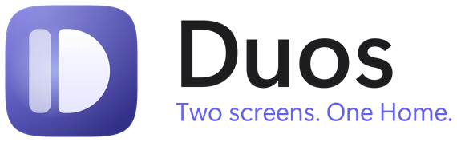
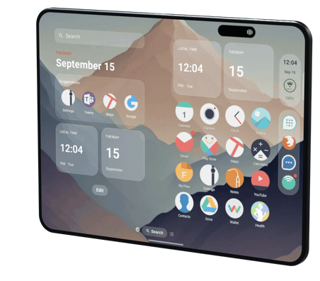
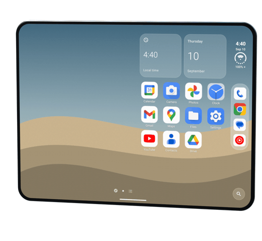

<p align="center">
  <picture>
    <source media="(prefers-color-scheme: dark)" srcset="docs/images/duos/banner-dark.gif">
    
  </picture>
</p>

<p align="center">
  <b>An iPhone-style Home for the Galaxy Z Fold 8, where folding the phone is the animation.</b>
</p>

<p align="center">
  
  
  
  <a href="LICENSE"></a>
  <a href="https://ko-fi.com/Z8Z2LCWU8"></a>
</p>

<p align="center">
  <picture>
    <source media="(prefers-color-scheme: dark)" srcset="docs/images/duos/fold-duo-dark.gif">
    
  </picture>
</p>

**Contents:** [The fold](#the-fold-is-the-animation) · [Apps and icons](#apps-grow-out-of-their-icons) ·
[Home](#home-tuned-for-two-screens) · [What you need](#what-you-need) · [Download](#download) · [Build](#build-from-source) ·
[Help](#bugs-and-help) · [Support](#support-the-project) · [Credits](#credits) · [License](#license)

## The fold is the animation

Duos follows the hinge's true angle, degree by degree, from the moment it moves. Stock One UI waits: the inner
screen usually lights around 122°. With Duos it comes on at about 16–40° and picks up the fold while the phone is
still opening. Folding shut, the front screen comes back early, so the picture is never gone.

Pick your look in **Settings › Fold & Displays › Fold animation**:

<table>
  <tr>
    <td width="50%" align="center">
      <picture>
        <source media="(prefers-color-scheme: dark)" srcset="docs/images/duos/glass-dark.gif">
        
      </picture>
    </td>
    <td width="50%" align="center">
      <picture>
        <source media="(prefers-color-scheme: dark)" srcset="docs/images/duos/fold-sweep-dark.gif">
        
      </picture>
    </td>
  </tr>
  <tr>
    <td align="center"><b>iPhone Duo</b><br><sub>The picture stays where it is. The half that moves is a pane of glass over it: blurred and darker the further it is from flat, clearer as it lies down. Tuned frame by frame against Apple's own film.</sub></td>
    <td align="center"><b>Fold8Duo sweep</b><br><sub>One soft dark front crosses the whole screen, with a glint riding it, so the two screens always hand over under the dark.</sub></td>
  </tr>
</table>

- **Over apps, not just Home.** An overlay draws the effect over the live picture of the app you're in, then gets
  out of the way.
- **Stays out of your way.** It holds off while the camera or a call is in front, and nothing runs at rest: the
  overlay only exists during a fold.

## Apps grow out of their icons

- **Apps fly back into their icons.** Swipe home and the app lands in the icon it came from: on the page, in the
  dock or in its folder. Opening an app grows it evenly out of its icon while Home zooms toward it.
- **Apps grow out of their icons (new).** A rounded card grows from the icon to the whole screen, showing the app as
  you last left it. Off by default while it's being tuned: *Settings › Fold & Displays*.
- **Apps fill the inner screen.** Every app follows the phone's rotation and fills the 4:3 inner screen, the way
  Samsung's per-app *Full screen* setting does, with a per-app switch for the few that shouldn't.

## Home, tuned for two screens

- **App Library as an A–Z list**, with an iPhone-style letter strip, *Recently Added*, and a list/tiles toggle beside
  the search field.
- **Swipe up on Home** opens the App Library, with the keyboard ready if you want it. **Press Home again** to go back
  to your first page.
- **Edit Pages:** move pages around, and hide a page without losing its apps.
- **Delete App** from an icon's menu, and **Clear badges when opened**.
- **Your assistant, from Home:** *Ask*, *Type to* and *Talk to* whichever assistant holds Android's assistant role.

Duos also includes the iPhone Duo Side Bar with the status bar, Dynamic Island and dock, Spotlight, Today View,
Control Center, widgets and Smart Stacks, jiggle mode, folders, themes, and the Tweak Library.

## What you need

- **A Galaxy Z Fold 8** (developed on the SM-F971U1, Android 17, One UI 9). Duos is tuned and supported on this phone
  only; behavior on other devices is not guaranteed.
- **Shizuku, for the real hinge.** Android only tells apps whether the hinge is at 0°, 90° or 180°, and late. With
  [Shizuku](https://shizuku.rikka.app/) running, Duos reads the hinge's true angle and can switch screens early.
  Connect it in *Settings › Fold & Displays › Real hinge (Shizuku)*. Without it, the fold effect runs on learned
  timings.
- **Settings › Display › Continue apps on cover screen › Always** on the phone, or it locks when you fold on Home.
- **Duos gestures & overlays** (Duos's accessibility service), for the effect over other apps and the pull-down panels.

No root. Knox, the bootloader and your lock screen are never touched.

## Download

Download the newest APK from [GitHub Releases](https://github.com/rmb707/Duos-Public/releases/latest). Android may
ask you to allow installs from the browser or file manager you use to open it.

## Build from source

```bash
./gradlew :app:assembleFast
adb install -r app/build/outputs/apk/fast/app-fast.apk
```

`assembleFast` is the R8-optimised build: judge smoothness with this one. The quick loop is
`./gradlew :app:assembleDebug :app:testDebugUnitTest`. JDK 21 works (JVM target 17). Then press Home and pick
**Duos**.

## Bugs and help

- **Found a bug?** In Duos, *Settings › Help › Report a Bug*, or [open an issue](https://github.com/rmb707/Duos-Public/issues).
- **Support:** [support@norfbay.com](mailto:support@norfbay.com)

## Support the project

Duos stands on a substantial open-source foundation. The Ko-fi page supports the upstream developer whose work Duos
builds on.

<p align="center">
  <a href="https://ko-fi.com/Z8Z2LCWU8"></a>
</p>

## Credits

- **[Folio](https://github.com/McCal-Codes/folio)** by McCal-Codes (MIT): the launcher Duos is built on, and nearly
  everything iOS about it. Duos preserves the upstream notices and compatibility seams so useful fixes can still be evaluated.
- **[DuoLauncher](https://github.com/jakesgoodapps/DuoLauncher)** by jakesgoodapps and the Duo Launcher contributors
  (MIT): Folio's own starting point, with the right-side dock and paired Home pages. The Home screens in the GIFs are
  from its README.
- **[iphone-duo](https://github.com/chuspeeism/iphone-duo)** by chuspeeism (MIT): the blur and darkening model Folio's
  fold effect started from.
- **[duo-open](https://github.com/marcoazeem/duo-open)** by marcoazeem (MIT): the turned-disk blur that gives the Duo
  style's glass its fine grain (idea only).
- Apple's *Introducing the new iPhone Duo* film was the reference for the Duo style. Its curves were measured from
  frames of the film. No Apple artwork is used.
- Everything Folio credits, in [Folio's README](https://github.com/McCal-Codes/folio#credits).

Apple, iPhone and iPad are trademarks of Apple Inc. Google and Android are trademarks of Google LLC. Samsung, Galaxy and
One UI are trademarks of Samsung Electronics Co., Ltd. Duos is an independent project, not affiliated with or endorsed
by Apple, Google or Samsung.

## License

[MIT](LICENSE), like Folio and DuoLauncher, whose notices are kept in `LICENSE`. Third-party licenses are in
[THIRD_PARTY_NOTICES.md](THIRD_PARTY_NOTICES.md).
